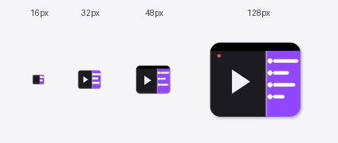

# VOD チャット同期 (VOD Chat Sync)

Twitch の VOD 再生に同期したチャットリプレイを、常時最前面の Picture-in-Picture
ウィンドウに表示するブラウザ拡張機能です。他の作業をしながら過去配信のチャットを
追いかけたい人向けに作りました。

<p align="center">
  
</p>

> 本拡張機能は Twitch Interactive, Inc. および BetterTTV / FrankerFaceZ / 7TV
> いずれとも提携・後援・スポンサー関係にありません。Twitch は各権利者の商標です。

[English version](./README.md)

---

## 主な機能

- **Document Picture-in-Picture** — 真の「常時最前面」ウィンドウです（Chrome /
  Edge 101 以降対応）。仮想デスクトップ間移動やフルスクリーンアプリを跨いでも
  表示が維持されます。
- **2 つのモード** — *動画＋チャット*（`captureStream` で VOD を PiP にミラー
  リング） / *チャットのみ*（CPU 負荷最小）。
- **サードパーティエモート** — BetterTTV / FrankerFaceZ / 7TV のグローバル＆
  チャンネル別エモートを各サービスの公開 API から直接取得し、ローカルに
  キャッシュします。
- **チャットクリックでシーク** — チャット行をクリックすると、その時刻に動画を
  ジャンプさせられます。
- **柔軟なレイアウト** — 仕切りをドラッグでチャット幅変更。不透明度、エモート
  サイズ、ヘッダ／ステータスバーの表示などすべて設定可能。
- **多言語対応** — 日本語 / 英語。

## インストール

### Chrome ウェブストア（公開後）

*準備中 — 公開後にリンクを追加します。*

### 手動インストール（開発用）

1. このリポジトリを clone またはダウンロード
2. `chrome://extensions`（または `edge://extensions`）を開く
3. **デベロッパーモード** を ON
4. **パッケージ化されていない拡張機能を読み込む** からプロジェクトフォルダを選択

## 使い方

1. Twitch の VOD ページ（`https://www.twitch.tv/videos/<id>`）を開く
2. 拡張機能アイコンをクリック → **今すぐ PiP で開く** を押す
3. フローティングウィンドウが開き、動画再生に合わせてチャットが流れ始めます。
   動画をシークすればチャットも追従します。

### 設定

設定画面（拡張機能アイコン → *設定を開く*）から以下を調整できます。

- **表示** — チャット不透明度、デフォルト幅、エモートサイズ、ヘッダ非表示、
  ステータスバー非表示
- **動作** — PiP への動画ミラーリング、チャットクリックでシーク

同じ画面から「診断情報をコピー」も可能です（個人情報なし、OAuth トークンは
自動マスク）。バグ報告に添付してください。

## 必要な権限

| 権限                              | 目的                                                             |
| -------------------------------- | ---------------------------------------------------------------- |
| `storage`                        | 設定をセッション間で保存                                          |
| `tabs`                           | ショートカットキーをアクティブな Twitch タブへ転送               |
| `https://www.twitch.tv/*`        | VOD ページを検出し UI を埋め込む                                  |
| `https://gql.twitch.tv/*`        | 公開 GraphQL エンドポイントから VOD コメントを取得（未認証）      |
| `https://static-cdn.jtvnw.net/*` | Twitch 公式エモート／バッジ画像のロード                          |
| `https://api.betterttv.net/*`, `https://cdn.betterttv.net/*` | BetterTTV エモート（匿名・GET のみ） |
| `https://api.frankerfacez.com/*` | FrankerFaceZ エモート（匿名・GET のみ）                           |
| `https://7tv.io/*`               | 7TV エモート（匿名・GET のみ）                                     |

## プライバシー

VOD チャット同期は個人データを一切**収集・送信・販売しません**。
すべての設定は `chrome.storage` でローカル保存され、外部への通信は上記の公開
API のみです。アカウント認証情報、ユーザー識別子、解析データなどは一切送信
していません。

詳細は [PRIVACY.ja.md](./PRIVACY.ja.md) をご覧ください。

## 仕組み（概要）

Twitch 自身の Web プレイヤーが VOD チャット再生に使っているのと同じ
`VideoCommentsByOffsetOrCursor` GraphQL オペレーションを、Android クライアント
ID で叩いています。コメントは `<video>.currentTime` より数秒先までバッファし、
Document PiP ウィンドウへ描画します。シーク時はバッファを破棄して新しい
オフセットから再取得します。

実装上の主要な選択は各ファイル冒頭にコメントで記載しています:

- `keep-active.js` — タブを背景化したとき Twitch プレイヤーが自動 pause しない
  よう、`visibilityState` を上書き
- `src/api/twitch-gql.js` — Android クライアント ID 利用により、Web 用 ID で
  発生する integrity-check レートリミットを回避
- `src/api/badges.js` — 2023 年 6 月に廃止された `badges.twitch.tv/v1` の代替と
  して、ハードコードしたグローバルバッジへフォールバック
- `src/core/lifecycle.js` — `documentPictureInPicture.requestWindow` の
  `NotAllowedError` を識別し、ユーザに具体的な手順を案内

## 対応ブラウザ

| ブラウザ             | 状態                                                |
| ------------------- | --------------------------------------------------- |
| Chrome 116+         | ✅ 完全対応 (Document PiP + `captureStream`)        |
| Edge 116+           | ✅ 完全対応                                          |
| Brave / Opera 116+  | ✅ 動作見込み（広範なテストはしていません）         |
| Firefox             | ❌ Document Picture-in-Picture API 未対応のため動作不可 |

## 開発者向け

```text
project/
├── manifest.json
├── background.js          # サービスワーカー（ショートカット転送）
├── content_script.js      # 本体ロジック・PiP DOM 構築・描画
├── keep-active.js         # タブ可視性偽装（MAIN world）
├── _locales/{en,ja}/messages.json
├── icons/
├── options/               # 設定画面
├── popup/                 # ツールバーポップアップ
└── src/
    ├── api/               # GraphQL / エモート / バッジ取得
    ├── core/              # i18n, settings, lifecycle, errors, feature-detect
    └── render/            # メッセージレンダラ
```

純粋な ES モジュールでビルドステップなし。開発サイクル: 編集 →
`chrome://extensions` で再読み込み → Twitch タブをリロード。

## コントリビューション

バグ報告・プルリクエスト歓迎です。大きな変更を入れる場合は、事前に Issue を
立てて議論してもらえると助かります。自動テストは未整備のため、提出前に
実際の Twitch VOD でご確認ください。

## ライセンス

[MIT](./LICENSE) © contributors.

## サポート

この拡張機能でアーカイブ視聴が快適になりましたら、Ko-fi からチップで応援していただけると嬉しいです。
完全に任意ですが、ご支援いただけると開発の励みになります！

[☕ ko-fi.com/Inanna2003](https://ko-fi.com/Inanna2003)
